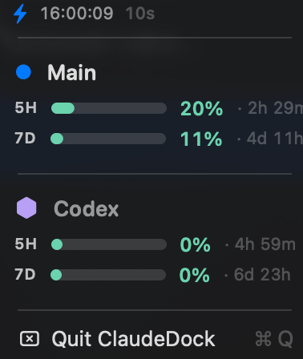

# ClaudeDock

ClaudeDock is a lightweight macOS menu bar app that shows **Claude** and **Codex/GPT** quota status in one place.



It is designed to:
- stay in the macOS menu bar (`LSUIElement` app)
- reuse existing local auth/state instead of creating duplicate login flows
- auto-start at login through a **user LaunchAgent**
- show both Claude and Codex usage with compact menu bar text and richer dropdown details

## What it shows

### Menu bar title
The menu bar title shows the **active Claude account's** 5-hour and 7-day
utilization:

```text
<5h %> · <7d %>
```

Example:

```text
61 · 48
```

Color reflects the higher of the two: green ≤50%, orange 50–80%, red >80%.

- left side = Claude 5-hour usage percent
- right side = Codex 5-hour usage percent
- no `A` / `C` prefixes

### Dropdown menu
The dropdown is a compact two-column dashboard:

| Limit | Claude | Codex |
|---|---:|---:|
| 5H | % | % |
| 7D | `% (sonnet%)` | % |

Notes:
- Claude and Codex are shown side by side as columns
- each cell shows a main percentage plus a small subtitle
- Claude subtitles show reset timing
- Codex subtitles show reset timing when available, otherwise last observed update timing
- there are no progress bars

The menu also includes:
- per-account cards showing `5h` and `7d` utilization with reset countdowns; active account is rendered bold
- inline **`↪ Switch to <label>`** action under each non-active account — swaps `Claude Code-credentials` keychain slot to that saved bundle without running `/login`. Stale slots (refresh token dead) are flagged `(stale — needs re-login)` and prompt for confirmation
- `Save current login as…` — prompts for a label and stores the current `Claude Code-credentials` blob into `ClaudeDock Account <label>`
- `Auto-rotate accounts` — checkbox toggle for the auto-rotation policy (see below)
- auto-refresh interval picker (15s / 30s / 1m / 2m / 5m)
- `Quit ClaudeDock`

Rename and delete are not wired in UI yet; do those via `security` CLI
+ `~/.claude/claudedock.json` (see below). See `docs/account-switching.md`
for full UX + screenshots.

## Multi-account workflow

ClaudeDock tracks N Claude accounts plus one Codex identity. Config lives
in `~/.claude/claudedock.json`:

```json
{
  "refreshInterval": 120,
  "activeAccountId": "main",
  "accounts": [
    {"id": "main", "label": "Main",  "kind": "claude"},
    {"id": "sub1", "label": "Sub1",  "kind": "claude"}
  ]
}
```

Semantics:

- `activeAccountId` declares which saved account corresponds to the live
  `Claude Code-credentials` keychain slot. The app uses the live blob
  (not the saved bundle) when fetching for the active account, and
  mirrors OAuth refresh back to both.
- Non-active accounts are fetched using their saved bundle (keychain
  service `ClaudeDock Account <label>`).
- If `activeAccountId` is empty or unknown but a live login exists, the
  menu shows a synthetic `Current login` row.

To add an account, the recommended path is now the menu:

1. `claude /login` as the account you want to save
2. Click ClaudeDock menu bar icon → **`Save current login as…`**
3. Enter a label (e.g. `Main`, `Sub1`)

The slot appears immediately. The same flow works for replacing a stale
slot — `Save current login as…` overwrites by label if it already exists.

Manual fallback (for renames, deletes, or scripted setup):

```bash
BLOB=$(security find-generic-password -s "Claude Code-credentials" -w)
security add-generic-password -U -s "ClaudeDock Account Main" -a ClaudeDock -w "$BLOB"
```

Then register the slot in `~/.claude/claudedock.json`:

```json
{"accounts": [{"id": "main", "label": "Main", "kind": "claude"}]}
```

### Switching active login

Click **`↪ Switch to <label>`** under any non-active account card. The
keychain `Claude Code-credentials` slot is overwritten, `activeAccountId`
is updated, and the menu refreshes.

**Caveat: running `claude` CLI keeps its old token in memory.** The swap
only affects the *next* `claude` launch. Already-open sessions continue
on the previous account until they exit.

If the target slot has a dead refresh token, the menu marks it
`(stale — needs re-login)` and a confirmation dialog appears before the
swap. Either re-save that slot via `Save current login as…` after running
`claude /login`, or proceed and re-run `/login` post-swap.

### Auto-rotation

ClaudeDock can auto-switch accounts when the active one approaches its
quota limits. Toggle via menu: **`Auto-rotate accounts`**.

Policy (pure function, unit-tested in `Tests/ClaudeDockCoreTests/`):

```
score(account, horizon = 2h):
  rem5h = 100 - util5h
  rem7d = 100 - util7d
  if util7d ≥ 100:   return -∞              # weekly cap absolute
  if reset5h within horizon: rem5h = 100    # imminent refill
  return min(rem5h, rem7d)                  # weakest constraint wins

Switch iff:
  - rotation.enabled
  - active.util5h ≥ 95 OR active.util7d ≥ 90    # threshold gate
  - all accounts not 7d-saturated                # avoid pointless flips
  - best_candidate.score ≥ active.score + 15    # 15pp hysteresis
  - now - lastRotateAt ≥ 600s                    # 10-min cooldown
```

Defaults (`RotationConfig.defaultConfig`):
- `high5h: 95`, `high7d: 90`
- `hysteresisPp: 15`
- `cooldownSec: 600` (10 min)
- `horizonSec: 7200` (2 h)

Override per-instance via `~/.claude/claudedock.json`:

```json
{
  "rotation": {
    "enabled": true,
    "high5h": 95,
    "high7d": 90,
    "hysteresisPp": 15,
    "cooldownSec": 600,
    "horizonSec": 7200
  }
}
```

Kill switch: `CLAUDEDOCK_AUTO_ROTATE=0` in the LaunchAgent environment
disables rotation regardless of config. Add it to `install_launchagent.sh`
under `EnvironmentVariables` to take effect.

When rotation fires, a macOS notification surfaces the swap and reason.
Caveat: running `claude` PIDs keep their tokens in memory — rotation
only affects the *next* `claude` launch.

### Known limitation

MCP servers (Slack, Google Drive, …) store their OAuth sessions keyed to
the authenticated Claude identity, inside each MCP server's own storage.
They always require re-authorization when you switch Claude identities —
this is not something ClaudeDock can preserve. Claude Code itself records
this state in `~/.claude/mcp-needs-auth-cache.json`. Plugin install state
and settings are **not** affected by switching.

### OAuth refresh

ClaudeDock attempts opportunistic OAuth refresh against Anthropic's token
endpoint when an account's access token is near expiry. On success the
refreshed blob is written back to both the saved bundle and, when the
account is the live login, the `Claude Code-credentials` keychain slot
— so the Claude CLI stays in sync. Without Claude Code's OAuth
`client_id` wired in, refresh fails gracefully and the account is marked
`re-login required` until a fresh `/login`.

### Rate limiting

`/api/oauth/usage` is rate-limited per token and shared with the Claude
CLI. On a 429 the app records a 120-second backoff for that account and
surfaces the stale cached value instead of hammering the endpoint. The
`↻ Refresh` menu item clears backoffs and forces a new fetch. Non-200
responses log status, `Retry-After`, and rate-limit headers to
`~/Library/Logs/ClaudeDock/stderr.log`.

## Data sources

### Claude
Claude data comes from Anthropic usage APIs via the existing local Claude auth state.

Source path in code:
- `ClaudeDock/UsageService.swift`
- `ClaudeDock/AccountStore.swift` (keychain I/O via `/usr/bin/security`)

Auth behavior:
- reuses keychain/file-backed Claude credentials
- does **not** create a separate login flow
- trusts `activeAccountId` as the mapping from saved bundle → live
  `Claude Code-credentials` slot (blob-equality matching is unreliable
  because tokens rotate)

### Codex / GPT
Codex data is local-only and does **not** use a separate network auth flow in this app.

The app reads Codex quota from:
1. `.omx/metrics.json`
2. if that is empty or `0/0`, fallback to latest `.codex/sessions/**/rollout-*.jsonl` `token_count` event

This fallback exists because OMX metrics can sometimes show `0/0` even when real Codex quota data is available in recent rollout files.

### Codex update time behavior
Codex is designed to look close to Claude in the menu, but the data source is different:

- **Claude** comes from a live API fetch
- **Codex** comes from local Codex/OMX session/runtime files

Because of that:
- when rollout data includes reset timestamps, Codex cells show reset timing like Claude
- when reset timestamps are missing, Codex cells fall back to last observed update timing
- the footer shows `Last refreshed: HH:MM:SS`

This is the main reason Codex can still behave slightly differently from Claude even though the menu layout is intentionally similar.

## Launch behavior

ClaudeDock is installed as a **user LaunchAgent**, not a system daemon.

### Installed files
- Binary:
  - `~/Library/Application Support/ClaudeDock/bin/ClaudeDock`
- LaunchAgent plist:
  - `~/Library/LaunchAgents/com.claudedock.ClaudeDock.plist`
- Logs:
  - `~/Library/Logs/ClaudeDock/stdout.log`
  - `~/Library/Logs/ClaudeDock/stderr.log`

### LaunchAgent environment
The LaunchAgent sets:
- `CODEX_HOME=<repo>/.codex`
- `CLAUDEDOCK_WORKSPACE_ROOT=<repo root>`

The app prefers the newest usable Codex quota event and currently scans:
- home `~/.codex/sessions`
- repo-local `.codex/sessions`
- `CODEX_HOME/sessions`

## Install / update

From the repository root:

```bash
./scripts/install_launchagent.sh
```

What it does:
1. builds the app in release mode
2. copies the binary into Application Support
3. writes/updates the LaunchAgent plist
4. bootstraps/restarts the LaunchAgent
5. updates global Codex status-line config

## Uninstall

```bash
./scripts/uninstall_launchagent.sh
```

This removes:
- the LaunchAgent plist
- the installed binary

## Codex status-line config

The installer updates:

```text
~/.codex/config.toml
```

Current `status_line` shape:

```toml
status_line = [ "model-name", "context-used", "context-window-size", "project-root", "git-branch", "five-hour-limit", "weekly-limit" ]
```

This is separate from ClaudeDock itself, but kept in sync by the installer.

## Project structure

### App code
- `ClaudeDock/AppDelegate.swift` — app lifecycle, refresh loop, menu bar title
- `ClaudeDock/UsageService.swift` — Claude fetch + Codex local metrics loading
- `ClaudeDock/MenuBuilder.swift` — dropdown menu construction
- `ClaudeDock/Models.swift` — shared data models
- `ClaudeDock/AccountStore.swift` — keychain bundle I/O via `security`
- `ClaudeDock/AccountSwitcher.swift` — save/switch/rename/delete helpers (switch + save wired into menu; rename/delete still CLI-only)
- `ClaudeDock/OAuthRefresher.swift` — token refresh against Anthropic OAuth endpoint
- `ClaudeDock/ClaudeDockEntry.swift` — app entry point

### Scripts
- `scripts/install_launchagent.sh` — build/install/restart app + LaunchAgent
- `scripts/uninstall_launchagent.sh` — remove LaunchAgent + installed binary
- `scripts/configure_codex_statusline.py` — update `~/.codex/config.toml`

## Behavior notes
- Claude and Codex values are shown as **used** percentages.
- Per-bucket color thresholds: green ≤50%, orange 50–80%, red >80%.
- Active account row is bold with a filled accent dot; inactive rows use
  the same label color but regular weight and a hollow dot.
- Each row shows 5H and 7D buckets side by side, followed by the reset
  countdown for that bucket.
- Manual `↻ Refresh` clears per-account rate-limit backoff and forces a
  fresh fetch.
- Footer shows `Last refreshed: HH:MM:SS`.

## Verification commands

Build:

```bash
swift build
```

Reinstall + restart LaunchAgent:

```bash
./scripts/install_launchagent.sh
```

Check LaunchAgent status:

```bash
launchctl print gui/$(id -u)/com.claudedock.ClaudeDock
```

## Current limitation
Codex still depends on local Codex session/runtime artifacts existing. If there is no usable recent local Codex session data yet, Codex quota can still be unavailable until a local session writes a valid quota event.
