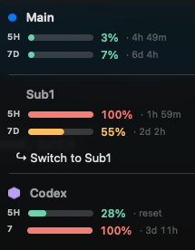

# Account Switching

ClaudeDock lets you keep multiple Claude Code logins side by side and
swap which one the `claude` CLI uses with a single menu click. Nothing
proxies traffic — the swap rewrites the macOS keychain entry that Claude
Code reads at startup.

## UI



What you see:

- **Main** (active) — bold, with 5H/7D utilization and reset countdowns
- **Sub1** — non-active, dimmed
- **`↪ Switch to Sub1`** — clickable action that swaps the live keychain
  slot to Sub1's stored blob
- **Codex** — local-only quota readout (Codex bridge, not relevant to
  Claude swapping)

When a stored slot's refresh token is dead, the action becomes
`↪ Switch to <label> (stale — needs re-login)` and clicking shows a
confirmation alert before writing the dead blob.

## How the swap works

1. `AccountSwitcher.switchTo(accountId:, config: &config)` reads the
   target slot's blob from keychain service `ClaudeDock Account <label>`
2. Writes that blob into keychain service `Claude Code-credentials` via
   `security add-generic-password -U`
3. Updates `~/.claude/claudedock.json` `activeAccountId`
4. If `~/.claude/.credentials.json` exists (older Claude Code installs),
   mirrors the blob there too
5. Kicks a fresh `UsageService.fetchUsage` so the menu re-renders

The swap is **byte-equivalent** to running `/login` as the other
account — same OAuth blob shape, same scopes. Anthropic's API resolves
the new access token to the new account on the next request.

## Caveats

### Running `claude` PIDs are unaffected

Claude Code reads the keychain entry at session start and caches the
token in process memory. A swap does not interrupt running sessions —
they continue on the prior account until they exit. The swap only
affects the **next** `claude` launch.

This is intentional. Killing in-flight sessions would destroy
streamed responses and partial tool calls.

### Refresh tokens die

OAuth refresh tokens have a TTL on the Anthropic side. A slot that
hasn't been used in a long time may need `claude /login` again before
it works. ClaudeDock detects this via the periodic usage fetch
(`/api/oauth/usage` returns 401/403) and marks the account
`needs re-login` in the cache. The switch UI warns before swapping
to a stale slot.

To recover a stale slot: `claude /login` as that account, then click
`Save current login as…` and reuse the same label — it overwrites.

### MCP server sessions

Slack, Google Drive, and other MCP integrations store their own OAuth
sessions keyed to the authenticated Claude identity. Switching accounts
will require you to re-authorize MCP integrations in the new account.
This is a Claude Code constraint, not something ClaudeDock can avoid.

## Adding an account

1. `claude /login` as the account you want to save
2. ClaudeDock menu → **`Save current login as…`**
3. Enter a label (`Main`, `Sub1`, `work`, whatever)

The label becomes the keychain service name suffix
(`ClaudeDock Account <label>`) and the display name in the menu.

### Scripted alternative

For automation or recovery:

```bash
BLOB=$(security find-generic-password -s 'Claude Code-credentials' -w)
security add-generic-password \
  -s 'ClaudeDock Account Main' \
  -a ClaudeDock -U -w "$BLOB"
```

Register the slot in `~/.claude/claudedock.json`:

```json
{
  "refreshInterval": 30,
  "activeAccountId": "1",
  "accounts": [
    {"id": "1", "label": "Main", "kind": "claude"},
    {"id": "2", "label": "Sub1", "kind": "claude"}
  ]
}
```

Restart ClaudeDock via `launchctl` so the menu reloads:

```bash
launchctl unload ~/Library/LaunchAgents/com.claudedock.ClaudeDock.plist
launchctl load   ~/Library/LaunchAgents/com.claudedock.ClaudeDock.plist
```

## Verifying a swap end-to-end

After clicking `↪ Switch to <label>`, confirm the live identity at
Anthropic's profile endpoint:

```bash
security find-generic-password -s 'Claude Code-credentials' -w \
  | python3 -c "
import json, sys, urllib.request as r
tok = json.load(sys.stdin)['claudeAiOauth']['accessToken']
req = r.Request(
    'https://api.anthropic.com/api/oauth/profile',
    headers={'Authorization': f'Bearer {tok}',
             'anthropic-beta': 'oauth-2025-04-20'})
print(json.loads(r.urlopen(req).read())['account']['email'])
"
```

You should see the email of the account you switched to.

## Renaming or deleting slots

Not yet wired in the UI. Use `security` CLI directly:

```bash
# Rename: read, re-write under new label, delete old
BLOB=$(security find-generic-password -s 'ClaudeDock Account OldLabel' -w)
security add-generic-password -s 'ClaudeDock Account NewLabel' \
  -a ClaudeDock -U -w "$BLOB"
security delete-generic-password -s 'ClaudeDock Account OldLabel'

# Delete
security delete-generic-password -s 'ClaudeDock Account ToRemove'
```

Then edit `~/.claude/claudedock.json` to match and restart ClaudeDock.

## Auto-rotation (planned, not yet implemented)

A `RotationPolicy` is planned that watches per-account 5H/7D
utilization and auto-swaps when the active account is saturated and a
candidate has headroom. Scoring will be
`min(remaining_5h_or_imminent_reset, remaining_7d)` with conservative
thresholds (5h ≥ 95%, 7d ≥ 90%), 15pp hysteresis, and 10-minute cooldown
to prevent flapping. See `docs/handoff.md` for the spec.

Auto-rotation will not interrupt running `claude` PIDs — same caveat as
manual switching.

## Internals

Relevant files:

- `ClaudeDock/AccountStore.swift` — keychain I/O via `/usr/bin/security`
- `ClaudeDock/AccountSwitcher.swift` — `saveCurrentAs`, `switchTo`,
  `rename`, `delete` (pure logic, no UI)
- `ClaudeDock/MenuBuilder.swift` — wires `↪ Switch to <label>` and
  `Save current login as…` action items into the dropdown
- `ClaudeDock/AppDelegate.swift` — `switchAccount(_:)` and
  `saveCurrentAs(_:)` handlers; shows confirmation alerts and refreshes
  after success
- `ClaudeDock/UsageService.swift` — detects stale tokens via
  `/api/oauth/usage` 401/403 and flags `needsReLogin` in the cache
